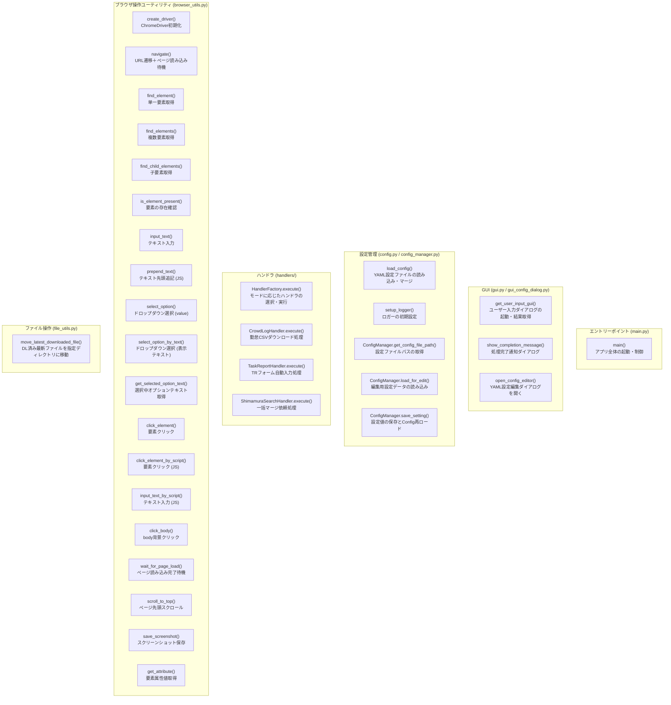

# Mermaid 構造図 - src/ 配下全ファイル
> 生成日: 2026-03-25
> 対象: src/main.py, src/gui.py, src/config.py, src/config_manager.py, src/handler_factory.py, src/file_utils.py, src/browser_utils.py, src/gui_config_dialog.py, src/handlers/base_handler.py, src/handlers/crowdlog_handler.py, src/handlers/task_report_handler.py, src/handlers/shimamura_search_handler.py

---

## 【図1】公開関数グループ図

**この図の読み方**
- 各 `subgraph` はモジュールまたは役割のまとまりを表します
- ノードは外部から呼び出せる公開関数・メソッドのみを載せています
- 呼び出し関係はこの図には含めません。詳細は【図2】を参照してください

---

## 【図2】全体詳細図

```mermaid
graph TD
  subgraph Public["公開関数・メソッド"]
    main["main()"]
    get_user_input_gui["get_user_input_gui()"]
    show_completion_message["show_completion_message()"]
    open_config_editor["open_config_editor()"]
    load_config["load_config()"]
    setup_logger["setup_logger()"]
    save_setting["ConfigManager.save_setting()"]
    load_for_edit["ConfigManager.load_for_edit()"]
    get_config_file_path["ConfigManager.get_config_file_path()"]
    hf_execute["HandlerFactory.execute()"]
    cl_execute["CrowdLogHandler.execute()"]
    tr_execute["TaskReportHandler.execute()"]
    ss_execute["ShimamuraSearchHandler.execute()"]
    move_latest["move_latest_downloaded_file()"]
  end

  subgraph PrivateConfig["内部ヘルパー: 設定系"]
    deep_merge["_deep_merge()\n辞書の再帰マージ"]
    apply_env["_apply_env_overrides()\n環境変数による上書き"]
    render_templates["_render_templates()\nテンプレート文字列のレンダリング"]
    create_handler["HandlerFactory._create_handler()\nハンドラ種別の決定"]
  end

  subgraph PrivateHandlers["内部ヘルパー: ハンドラ系"]
    cl_settings["CrowdLogHandler._get_settings()"]
    cl_dates["CrowdLogHandler._get_dynamic_dates()\n今月の初日・末日を計算"]
    cl_login["CrowdLogHandler._perform_login_if_needed()\nログイン画面検出・実行"]
    cl_download["CrowdLogHandler._click_download_button()\nDLボタンクリック"]
    tr_settings["TaskReportHandler._get_settings()"]
    ss_extract["ShimamuraSearchHandler._extract_results()\n検索結果行からデータ抽出"]
    ss_table["ShimamuraSearchHandler._print_results_table()\n抽出結果の一覧表示"]
    ss_process["ShimamuraSearchHandler._process_row()\n1件分の詳細ページ処理"]
    ss_summary["ShimamuraSearchHandler._print_summary()\n処理結果サマリー出力"]
    ss_comment["ShimamuraSearchHandler._prepend_comment()\nコメント先頭追記"]
    ss_status["ShimamuraSearchHandler._change_status()\nステータス変更"]
    ss_save["ShimamuraSearchHandler._save_and_screenshot()\n保存＋SS撮影"]
  end

  subgraph BrowserUtils["ブラウザ操作ユーティリティ (browser_utils.py)"]
    create_driver["create_driver()"]
    navigate_b["navigate()"]
    find_element_b["find_element()"]
    find_elements_b["find_elements()"]
    find_child_b["find_child_elements()"]
    get_attr_b["get_attribute()"]
    is_present_b["is_element_present()"]
    wait_load["wait_for_page_load()"]
    input_text_b["input_text()"]
    prepend_b["prepend_text()"]
    select_b["select_option()"]
    select_text_b["select_option_by_text()"]
    get_selected_b["get_selected_option_text()"]
    click_b["click_element()"]
    click_js_b["click_element_by_script()"]
    click_body_b["click_body()"]
    scroll_b["scroll_to_top()"]
    screenshot_b["save_screenshot()"]
  end

  %% main の呼び出し
  main --> load_config
  main --> setup_logger
  main --> get_user_input_gui
  main --> create_driver
  main --> navigate_b
  main --> is_present_b
  main --> click_b
  main --> hf_execute
  main --> ss_execute
  main --> move_latest
  main --> show_completion_message

  %% GUI
  get_user_input_gui --> open_config_editor
  open_config_editor --> load_for_edit
  open_config_editor --> save_setting

  %% 設定管理
  load_config --> deep_merge
  load_config --> apply_env
  load_config --> render_templates
  load_for_edit --> get_config_file_path
  save_setting --> get_config_file_path
  save_setting --> load_config

  %% HandlerFactory
  hf_execute --> create_handler
  create_handler --> cl_execute
  create_handler --> tr_execute

  %% CrowdLogHandler
  cl_execute --> cl_settings
  cl_execute --> cl_login
  cl_execute --> cl_dates
  cl_execute --> input_text_b
  cl_execute --> cl_download
  cl_login --> is_present_b
  cl_login --> input_text_b
  cl_login --> click_b
  cl_download --> click_body_b
  cl_download --> click_b
  cl_download --> click_js_b

  %% TaskReportHandler
  tr_execute --> tr_settings
  tr_execute --> input_text_b
  tr_execute --> select_b

  %% ShimamuraSearchHandler
  ss_execute --> navigate_b
  ss_execute --> ss_extract
  ss_execute --> ss_table
  ss_execute --> ss_process
  ss_execute --> ss_summary
  ss_extract --> find_elements_b
  ss_extract --> find_child_b
  ss_extract --> get_attr_b
  ss_process --> navigate_b
  ss_process --> ss_comment
  ss_process --> ss_status
  ss_process --> ss_save
  ss_comment --> prepend_b
  ss_status --> select_text_b
  ss_status --> get_selected_b
  ss_save --> click_js_b
  ss_save --> wait_load
  ss_save --> scroll_b
  ss_save --> screenshot_b
  ss_save --> navigate_b

  %% browser_utils 内部
  navigate_b --> wait_load
  is_present_b --> find_element_b
  input_text_b --> find_element_b
  prepend_b --> find_element_b
  select_b --> find_element_b
  select_text_b --> find_element_b
  get_selected_b --> find_element_b
  click_b --> find_element_b
  click_js_b --> find_element_b
  click_body_b --> find_element_b
```

**主要な処理フロー**
- **起動フロー**: `main()` → `load_config()` → `get_user_input_gui()` → モード判定 → 各ハンドラ実行
- **勤怠 (CrowdLog) フロー**: `HandlerFactory` → `CrowdLogHandler.execute()` → ログイン → 日付入力 → DLボタン押下 → `move_latest_downloaded_file()`
- **TR入力フロー**: `HandlerFactory` → `TaskReportHandler.execute()` → 設定マージ → テキスト入力 / ドロップダウン選択
- **マージ依頼フロー**: `ShimamuraSearchHandler.execute()` → 検索URL遷移 → 結果抽出 → 各詳細ページでコメント追記・ステータス変更・保存・SS撮影
- **設定編集フロー**: `SelectionApp._open_config_editor()` → `open_config_editor()` → `ConfigManager.load_for_edit()` → 編集 → `ConfigManager.save_setting()` → `load_config()` 再ロード
