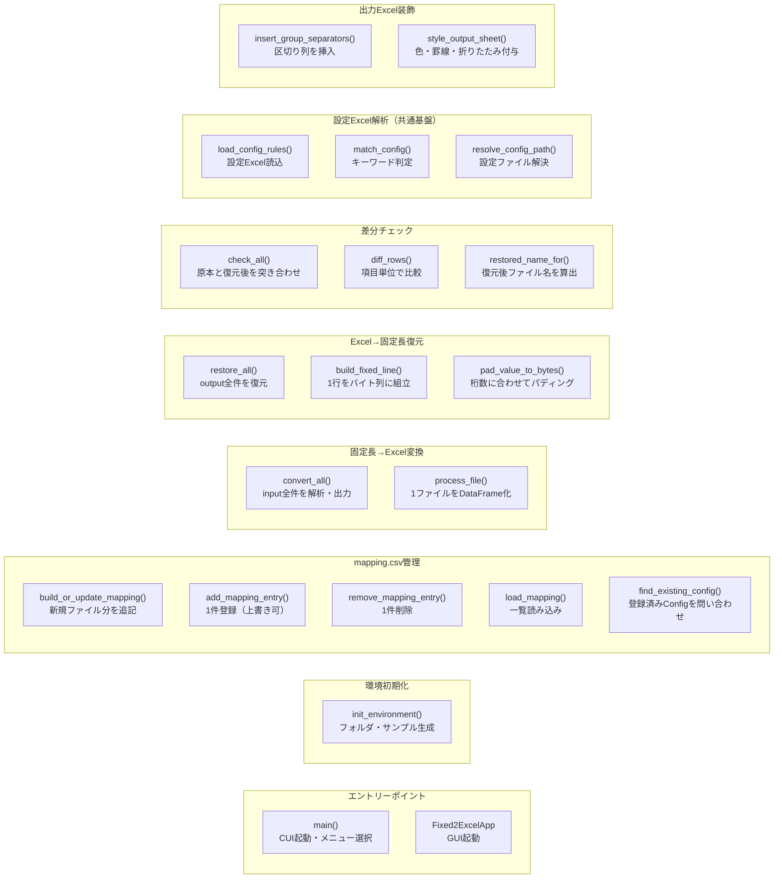

# Mermaid 構造図 - 34_Fixed2Excel

> 生成日: 2026-07-31
> 対象: `src/` 配下全ファイル（gui.py, main.py, app_context.py, config_manager.py, mapping_editor_window.py, handlers/*.py, utils/*.py）

## 図1: 公開関数グループ図

### この図の読み方

- 各グループが1つの機能（GUIの操作ボタンや、その裏側で共通に使われる処理）に対応しています。呼び出し関係はあえて省略し、「どんな機能がどこにあるか」の見取り図として使ってください。
- 「設定Excel解析」「出力Excel装飾」の2グループは、他の機能グループ（変換・復元・差分チェック）から横断的に呼ばれる共通基盤です。
- 「mapping.csv管理」はGUIの「mapping.csv 編集」ウィンドウとCUI/GUIの「mapping.csv 更新」ボタンの両方から使われます。

## 図2: 全体詳細図

```mermaid
flowchart TD
    subgraph PUBLIC["■ 公開関数"]
        direction TB

        subgraph P_ENTRY["エントリーポイント"]
            main_cui["main()<br/>main.py"]
            gui_app["Fixed2ExcelApp<br/>gui.py"]
        end

        subgraph P_SETUP["環境初期化<br/>(setup_handler.py)"]
            init_environment["init_environment()"]
        end

        subgraph P_MAPPING["mapping.csv管理<br/>(mapping_handler.py)"]
            build_or_update_mapping["build_or_update_mapping()"]
            add_mapping_entry["add_mapping_entry()"]
            remove_mapping_entry["remove_mapping_entry()"]
            load_mapping["load_mapping()"]
            find_existing_config["find_existing_config()"]
        end

        subgraph P_MAPPING_GUI["mapping編集ウィンドウ<br/>(mapping_editor_window.py)"]
            me_refresh["refresh()"]
            me_set_locked["set_locked()"]
        end

        subgraph P_TOEXCEL["固定長→Excel変換<br/>(fixed_to_excel.py)"]
            convert_all["convert_all()"]
            process_file["process_file()"]
        end

        subgraph P_TOFIXED["Excel→固定長復元<br/>(excel_to_fixed.py)"]
            restore_all["restore_all()"]
            build_fixed_line["build_fixed_line()"]
            pad_value_to_bytes["pad_value_to_bytes()"]
        end

        subgraph P_DIFF["差分チェック<br/>(diff_checker.py)"]
            check_all["check_all()"]
            diff_rows["diff_rows()"]
            restored_name_for["restored_name_for()"]
        end

        subgraph P_CONFIG["設定Excel解析<br/>(fixed_format.py)"]
            load_config_rules["load_config_rules()"]
            match_config["match_config()"]
            resolve_config_path["resolve_config_path()"]
        end

        subgraph P_DECORATE["出力Excel装飾<br/>(excel_style.py)"]
            insert_group_separators["insert_group_separators()"]
            style_output_sheet["style_output_sheet()"]
            is_separator_column["is_separator_column()"]
        end

        subgraph P_BASE["共通基盤<br/>(app_context.py / config_manager.py / logger.py / log_tags.py)"]
            create_context["create_context()"]
            setup_logger["setup_logger()"]
            load_config_cm["ConfigManager.load_config()"]
            log_start["log_start()"]
            log_end["log_end()"]
        end
    end

    subgraph HELPER["■ 内部ヘルパー"]
        direction TB

        subgraph H_MAPPING_GUI["mapping編集ウィンドウ内部<br/>(mapping_editor_window.py)"]
            me_init["__init__()"]
            me_build_widgets["_build_widgets()"]
            me_reload_files["_reload_file_lists()"]
            me_on_input_selected["_on_input_selected()"]
            me_on_register["_on_register()"]
            me_on_delete["_on_delete()"]
        end

        subgraph H_SETUP["サンプル生成系<br/>(setup_handler.py)"]
            with_padding_filler["_with_padding_filler()"]
            sheet_df["_sheet_df()"]
            build_line["_build_line()"]
        end

        subgraph H_MAPPING["mapping内部処理<br/>(mapping_handler.py)"]
            backup_existing_file["_backup_existing_file()"]
        end

        subgraph H_TOEXCEL["変換内部処理<br/>(fixed_to_excel.py)"]
            flatten_field_rules["_flatten_field_rules()"]
        end

        subgraph H_CONFIG["設定解析内部処理<br/>(fixed_format.py)"]
            parse_sheet_rules["parse_sheet_rules()"]
        end

        subgraph H_DIFF["差分内部処理<br/>(diff_checker.py)"]
            values_equal["_values_equal()"]
        end

        subgraph H_DECORATE["装飾・グルーピング内部処理<br/>(excel_style.py)"]
            comment_text["_comment_text()"]
            column_type["_column_type()"]
            display_width["_display_width()"]
            group_contiguous_ranges["_group_contiguous_ranges()"]
            group_row_ranges["_group_row_ranges()"]
            group_column_ranges["_group_column_ranges()"]
        end
    end

    %% ---- 呼び出し関係 ----
    main_cui --> create_context
    main_cui --> setup_logger
    main_cui --> init_environment
    main_cui --> build_or_update_mapping
    main_cui --> convert_all
    main_cui --> restore_all
    main_cui --> check_all

    gui_app --> create_context
    gui_app --> setup_logger
    gui_app --> init_environment
    gui_app --> build_or_update_mapping
    gui_app --> convert_all
    gui_app --> restore_all
    gui_app --> check_all
    gui_app --> me_init
    gui_app --> me_set_locked
    gui_app --> me_refresh

    create_context --> load_config_cm

    init_environment --> sheet_df
    init_environment --> build_line
    build_line --> build_fixed_line

    build_or_update_mapping --> backup_existing_file
    add_mapping_entry --> load_mapping
    add_mapping_entry --> backup_existing_file
    remove_mapping_entry --> load_mapping
    remove_mapping_entry --> backup_existing_file
    find_existing_config --> load_mapping

    me_init --> me_build_widgets
    me_init --> me_refresh
    me_on_register --> find_existing_config
    me_on_register --> add_mapping_entry
    me_on_register --> me_refresh
    me_on_delete --> remove_mapping_entry
    me_on_delete --> me_refresh
    me_refresh --> load_mapping
    me_refresh --> me_reload_files

    convert_all --> resolve_config_path
    convert_all --> load_config_rules
    convert_all --> process_file
    convert_all --> flatten_field_rules
    convert_all --> insert_group_separators
    convert_all --> style_output_sheet

    restore_all --> resolve_config_path
    restore_all --> load_config_rules
    restore_all --> build_fixed_line
    build_fixed_line --> pad_value_to_bytes

    check_all --> resolve_config_path
    check_all --> load_config_rules
    check_all --> process_file
    check_all --> restored_name_for
    check_all --> diff_rows
    diff_rows --> values_equal

    resolve_config_path --> match_config
    load_config_rules --> parse_sheet_rules

    insert_group_separators --> column_type
    style_output_sheet --> comment_text
    style_output_sheet --> group_row_ranges
    style_output_sheet --> group_column_ranges
    style_output_sheet --> is_separator_column
    style_output_sheet --> display_width
    group_row_ranges --> group_contiguous_ranges
    group_column_ranges --> group_contiguous_ranges
    group_column_ranges --> column_type
```

### 主要な処理フロー

- CUI(`main.py`)・GUI(`gui.py`)のどちらから操作しても、5つの操作（環境初期化・mapping更新・固定長→Excel変換・Excel→固定長復元・差分チェック）は同じ`create_context()`で組み立てた`AppContext`を介して同じhandler関数を呼び出す（CUI/GUIで処理の実体は完全に共有）。
- 固定長→Excel変換・Excel→固定長復元・差分チェックの3機能は、いずれも設定ファイルの解決処理（`resolve_config_path()` → `match_config()`）と`load_config_rules()`を必ず経由する共通基盤に依存している。キーワード不一致・複数一致・設定ファイル欠落のログ出しもここに集約されている。
- mapping編集ウィンドウの登録処理（`_on_register()`）は、上書き確認のために`find_existing_config()`で既存登録を問い合わせてから`add_mapping_entry()`を呼ぶ。ドメイン操作（DataFrameの読み書き）は`mapping_handler.py`に集約し、GUI側は「確認ダイアログを出すかどうか」の判断のみを担う。
- 出力Excelの見やすさ（列幅・色分け・折りたたみ）は`convert_all()`内で`insert_group_separators()` → `style_output_sheet()`の順に適用され、実際の描画ロジックは`excel_style.py`内の複数の内部ヘルパー（`_group_*`系）に分解されている。
- 差分チェック(`check_all()`)は固定長→Excel変換で使う`process_file()`をそのまま再利用し、原本と復元後を同じ解析ロジックでDataFrame化してから`diff_rows()`で項目単位に突き合わせる。
