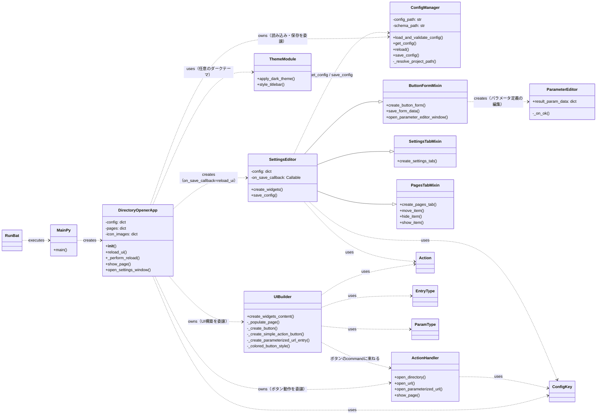

```mermaid
classDiagram
    direction LR

    class RunBat
    class MainPy {
        +main()
    }

    class DirectoryOpenerApp {
        -config: dict
        -pages: dict
        -icon_images: dict
        +__init__()
        +reload_ui()
        +_perform_reload()
        +show_page()
        +open_settings_window()
    }

    class ConfigManager {
        -config_path: str
        -schema_path: str
        +load_and_validate_config()
        +get_config()
        +reload()
        +save_config()
        -_resolve_project_path()
    }

    class ActionHandler {
        +open_directory()
        +open_url()
        +open_parameterized_url()
        +show_page()
    }

    class UIBuilder {
        +create_widgets_content()
        -_populate_page()
        -_create_button()
        -_create_simple_action_button()
        -_create_parameterized_url_entry()
        -_colored_button_style()
    }

    class ThemeModule {
        +apply_dark_theme()
        +style_titlebar()
    }

    class SettingsEditor {
        -config: dict
        -on_save_callback: Callable
        +create_widgets()
        +save_config()
    }
    class SettingsTabMixin {
        +create_settings_tab()
    }
    class PagesTabMixin {
        +create_pages_tab()
        +move_item()
        +hide_item()
        +show_item()
    }
    class ButtonFormMixin {
        +create_button_form()
        +save_form_data()
        +open_parameter_editor_window()
    }
    class ParameterEditor {
        +result_param_data: dict
        -_on_ok()
    }

    class Action
    class ConfigKey
    class EntryType
    class ParamType

    RunBat ..> MainPy : executes
    MainPy ..> DirectoryOpenerApp : creates

    DirectoryOpenerApp ..> ConfigManager : owns（読み込み・保存を委譲）
    DirectoryOpenerApp ..> ActionHandler : owns（ボタン動作を委譲）
    DirectoryOpenerApp ..> UIBuilder : owns（UI構築を委譲）
    DirectoryOpenerApp ..> ThemeModule : uses（任意のダークテーマ）
    DirectoryOpenerApp ..> SettingsEditor : creates（on_save_callback=reload_ui）

    UIBuilder ..> ActionHandler : ボタンのcommandに束ねる

    SettingsEditor --|> SettingsTabMixin
    SettingsEditor --|> PagesTabMixin
    SettingsEditor --|> ButtonFormMixin
    SettingsEditor ..> ConfigManager : get_config / save_config
    ButtonFormMixin ..> ParameterEditor : creates（パラメータ定義の編集）

    DirectoryOpenerApp ..> ConfigKey : uses
    UIBuilder ..> Action : uses
    UIBuilder ..> EntryType : uses
    UIBuilder ..> ParamType : uses
    ActionHandler ..> ConfigKey : uses
    SettingsEditor ..> Action : uses
    SettingsEditor ..> ConfigKey : uses
```
