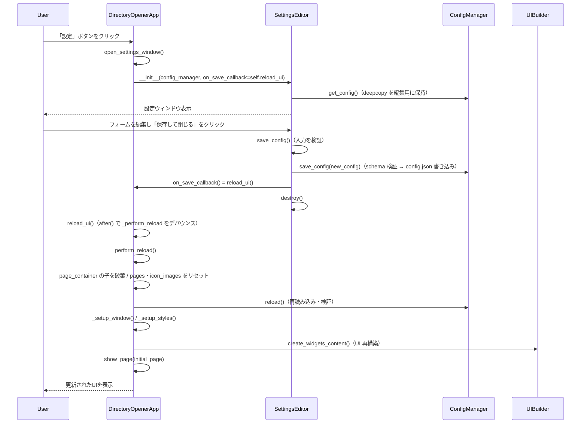

```mermaid
sequenceDiagram
    participant User
    participant App as DirectoryOpenerApp
    participant Editor as SettingsEditor
    participant CM as ConfigManager
    participant Builder as UIBuilder

    User->>App: 「設定」ボタンをクリック
    App->>App: open_settings_window()
    App->>Editor: __init__(config_manager, on_save_callback=self.reload_ui)
    Editor->>CM: get_config()（deepcopy を編集用に保持）
    Editor-->>User: 設定ウィンドウ表示

    User->>Editor: フォームを編集し「保存して閉じる」をクリック
    Editor->>Editor: save_config()（入力を検証）
    Editor->>CM: save_config(new_config)（schema 検証 → config.json 書き込み）
    Editor->>App: on_save_callback() = reload_ui()
    Editor->>Editor: destroy()

    App->>App: reload_ui()（after() で _perform_reload をデバウンス）
    App->>App: _perform_reload()
    App->>App: page_container の子を破棄 / pages・icon_images をリセット
    App->>CM: reload()（再読み込み・検証）
    App->>App: _setup_window() / _setup_styles()
    App->>Builder: create_widgets_content()（UI 再構築）
    App->>App: show_page(initial_page)
    App-->>User: 更新されたUIを表示
```
