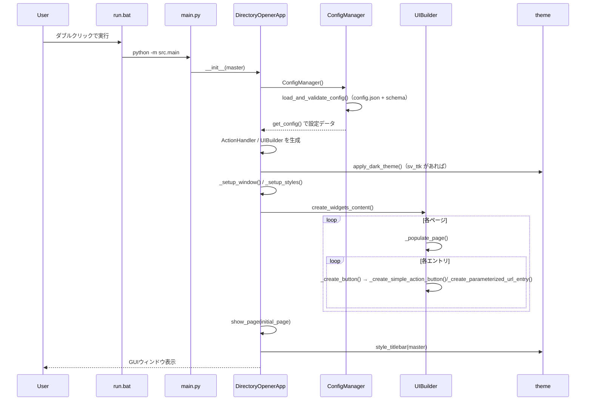

```mermaid
sequenceDiagram
    participant User
    participant run.bat
    participant main.py
    participant App as DirectoryOpenerApp
    participant CM as ConfigManager
    participant Builder as UIBuilder
    participant theme

    User->>run.bat: ダブルクリックで実行
    run.bat->>main.py: python -m src.main
    main.py->>App: __init__(master)

    App->>CM: ConfigManager()
    CM->>CM: load_and_validate_config()（config.json + schema）
    CM-->>App: get_config() で設定データ

    App->>App: ActionHandler / UIBuilder を生成
    App->>theme: apply_dark_theme()（sv_ttk があれば）
    App->>App: _setup_window() / _setup_styles()
    App->>Builder: create_widgets_content()
    loop 各ページ
        Builder->>Builder: _populate_page()
        loop 各エントリ
            Builder->>Builder: _create_button() → _create_simple_action_button()/_create_parameterized_url_entry()
        end
    end
    App->>App: show_page(initial_page)
    App->>theme: style_titlebar(master)
    App-->>User: GUIウィンドウ表示
```
