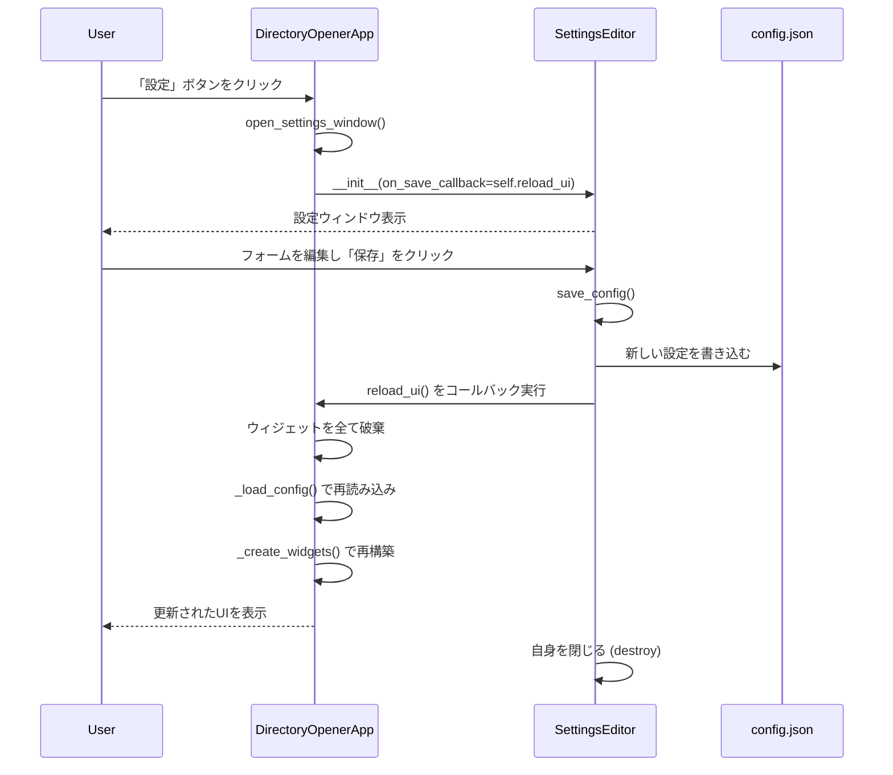

```mermaid
sequenceDiagram
    participant User
    participant App as DirectoryOpenerApp
    participant Editor as SettingsEditor
    participant config.json

    User->>App: 「設定」ボタンをクリック
    App->>App: open_settings_window()
    App->>Editor: __init__(on_save_callback=self.reload_ui)
    Editor-->>User: 設定ウィンドウ表示

    User->>Editor: フォームを編集し「保存」をクリック
    Editor->>Editor: save_config()
    Editor->>config.json: 新しい設定を書き込む
    Editor->>App: reload_ui() をコールバック実行
    App->>App: ウィジェットを全て破棄
    App->>App: _load_config() で再読み込み
    App->>App: _create_widgets() で再構築
    App-->>User: 更新されたUIを表示
    Editor->>Editor: 自身を閉じる (destroy)
```