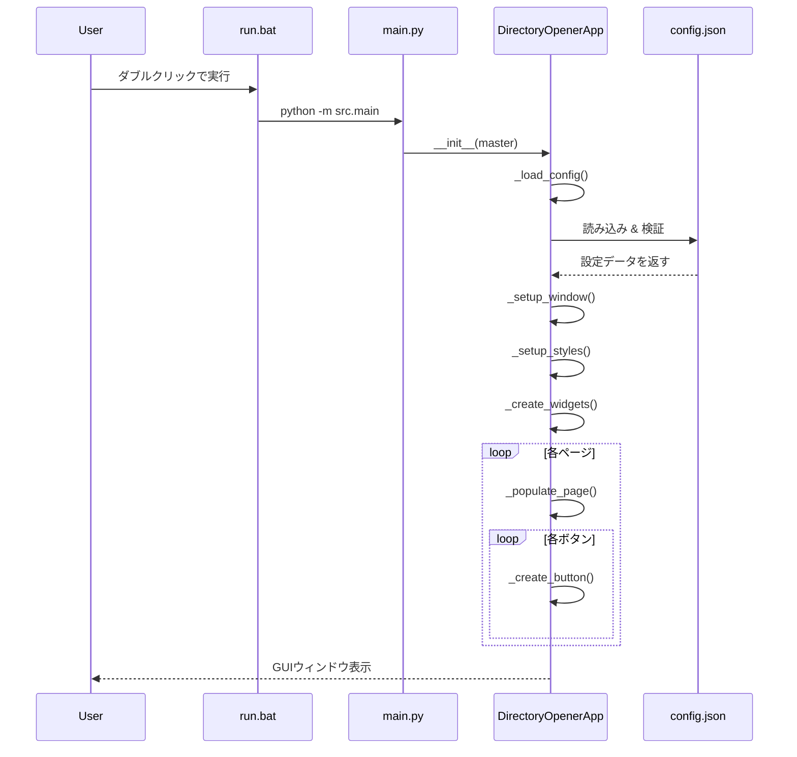

```mermaid
sequenceDiagram
    participant User
    participant run.bat
    participant main.py
    participant App as DirectoryOpenerApp
    participant config.json

    User->>run.bat: ダブルクリックで実行
    run.bat->>main.py: python -m src.main
    main.py->>App: __init__(master)
    App->>App: _load_config()
    App->>config.json: 読み込み & 検証
    config.json-->>App: 設定データを返す
    App->>App: _setup_window()
    App->>App: _setup_styles()
    App->>App: _create_widgets()
    loop 各ページ
        App->>App: _populate_page()
        loop 各ボタン
            App->>App: _create_button()
        end
    end
    App-->>User: GUIウィンドウ表示
```